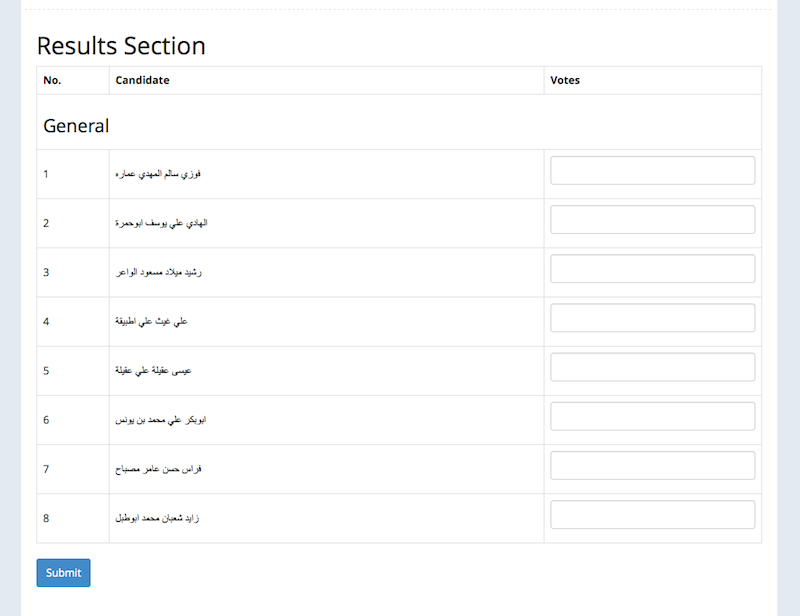
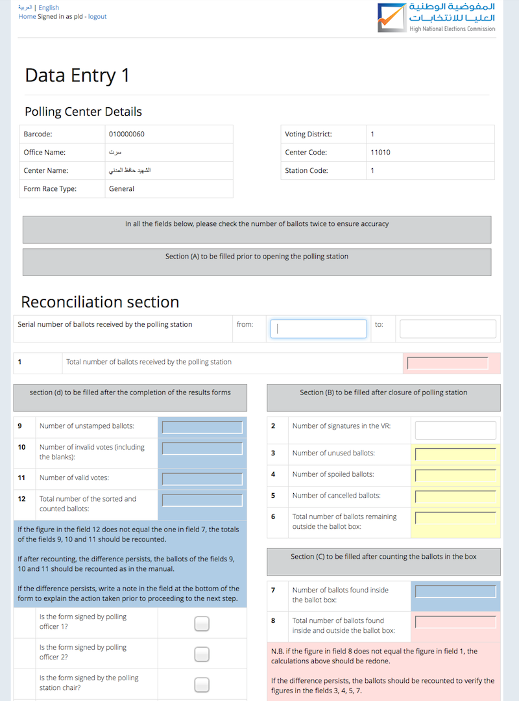
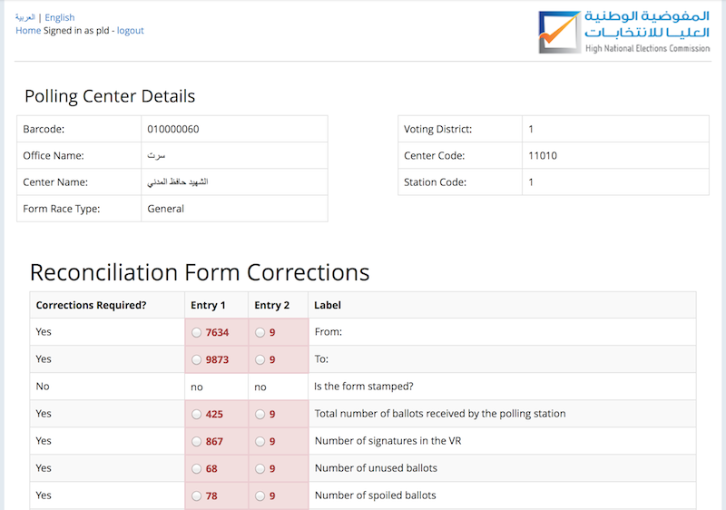
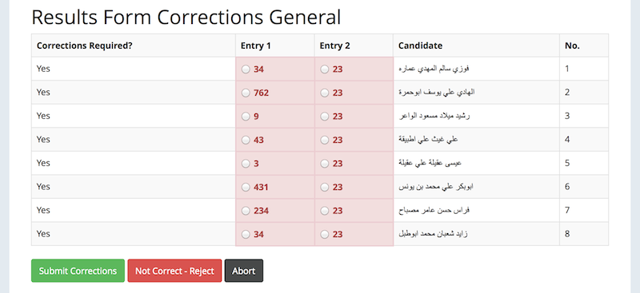
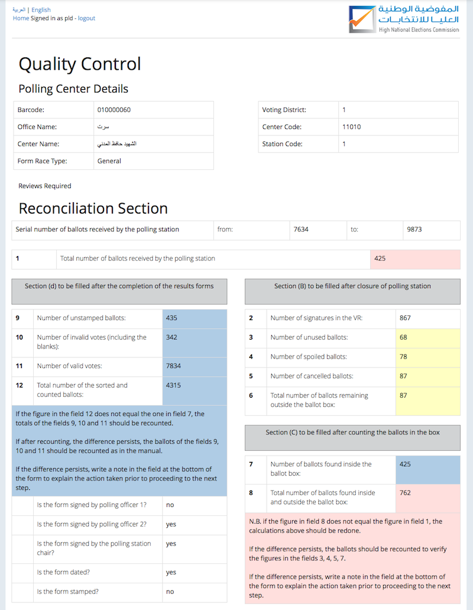
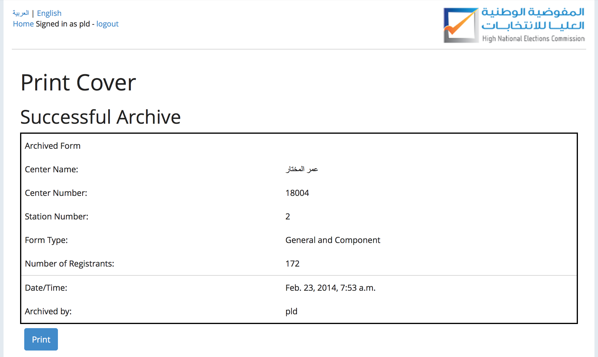
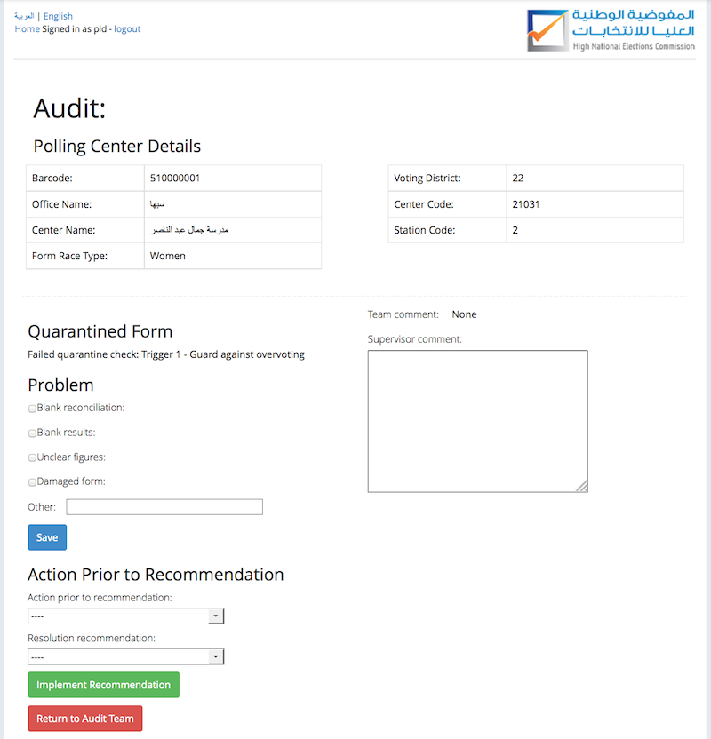
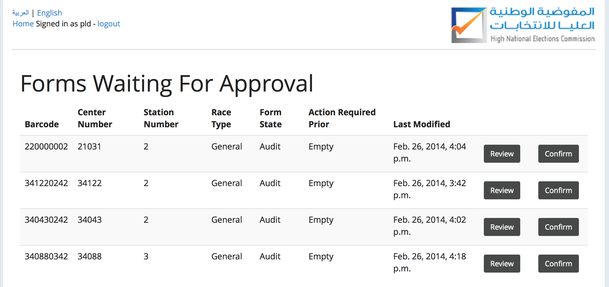
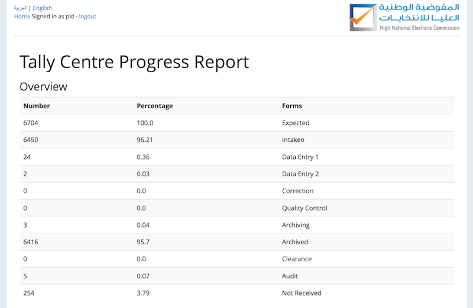
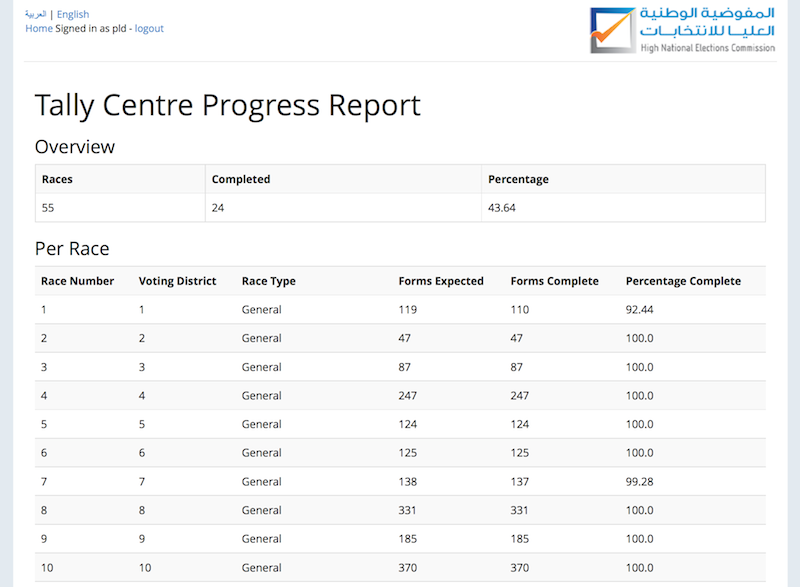

# System Overview

**tally-system** is used to record, verify, and report the results of paper votes
that have been used in an election.  Tally centers enter *result forms* and
*reconciliation forms* into the **tally-system**.  Each form has a unique
barcode which links the form to the center, station, and ballot (with the exception of
*replacement forms*, discussed below).  Using this
information the system retrieves the candidates for the race and clerks then
enter the results.

The **tally-system** process consists of 6 stages in the *main pipeline* and two
*review stages*. Overall, the process proceeds as follows:

* the paper form is received,
* the clerks process it through the system,
* after being successfully processed the paper form is archived and the results can be exported from the system.

The system includes a number of results dashboards that show the progress of
forms through the various stages of the system as well as completion statistics
for individual races.

## Idiosyncracies

The **tally-system** was built specifically to facilitate result counting in the
Libyan Constituent Assembly elections held February 20th, 2014.  The
system functionality and the flow used throughout the system is applicable to most
elections involving aggregated results and paper ballot counting.

None the less, the system does involve functionality designed to support
the idiosyncracies of this particular election.  The primary
idiosyncracies are in:

1. The granular division of result forms,
2. The existence of women and minority group ballots.

### The Division of Result Forms

A *Result Form* is the essential unit of data entry on which votes for
candidates are recorded.

Each result form is pre-assigned to a *Sub Constituency*, *Office*, and *Ballot*.
*Sub Constituency* and *Office* are markers of location, roughly analogous to
voting districts.  A ballot is equivalent to a *Race*.  It determines the candidates that appear
on the result form.  When all the result forms for a race have been entered
the system can confidently calculate the race results and determine a winner.

The *Center* and *Station* are preassigned for some result forms and are
assigned upon entry for other result forms, dependent on the barcode of the form.
Each result form must be for a unique ballot, center, and station combination.

### Womens and Component Ballots

In the Libyan Constituent Assembly additional seats are allocation, and hence races must be run, for female
candidates (Women ballots) as well as for candidates from specific ethnic minority groups (Component ballots).
Therefore, each sub constituencies either has a General ballot, a General
ballot and a Womens ballot, or a General Plus Component ballot.

For component races, the candidates that appear on result forms for a specific
component race may be shared accross multiple General ballots.  For example,
although the General race candidates in Sebha office races 17 through 21 each
have different candidates on the General ballots, the component candidates for
races 17 through 21 are all the same.

## Main Pipeline

The main pipeline begins when a paper results form is received. The result form
passes through the following stages in sequence:

1. Intake
2. Data Entry 1
3. Data Entry 2
4. Corrections
5. Quality Control
6. Archiving

System administrators assign clerks to specific stages and a clerk is only able
to use the functionality in their assigned stage.

### Intake

In Intake the Intake Clerk enters the barcode for the received form.  If the
form is not a replacement form it will have a pre-assigned center and station.
If it is a replacement form the clerk will next enter the center and station
number for that form.

The original form or the replacement form is a duplicate if there is already a
form in the system with the same ballot, center, and station.  If the form is a
duplicate the system will move it to *Clearance* and instruct the clerk to move
the physical form to the Clearance section.

If the form is not a duplicate the system will show additional details, which
appear on the header of the form.  The Clerk then checks that the system
details match the printed form details and selects "Correct", "Incorrect - send
to Clearance", or "Abort - re-enter barcode".

If the Clerk selects "Correct" the system displays an Intake print-cover for
the form, which the clerk then prints.  Upon successful printing the clerk
selcts "Print Successful" and the system moves the form to *Data Entry 1*.  The
clerk is instructed to move the physical form to the Data Entry 1 section.

If the Clerk selects "Incorrect" the system moves the form to Clearance and the
clerk is instructed to move the physical form the Clearance section.  If
the Clerk selects "Abort" they are returned to the barcode entry screen.

### Data Entry

There are two data entry sections: Data Entry 1 and Data Entry 2.  To ensure
the validity of entered data two different people will enter the form data.
All forms include a results component.  If the form is not an Out of Country Voting (OCV) or Count Center form, data entry
includes an additional reconcilliation component.

The Data Entry Clerk begins by entering the barcode for a form they have
received.  The system then shows the results component, which displays the
candidates that appear on the ballot assigned
to the form in the order in which they appear on the ballot (and form).  The physical form
shows the number of results for each candidate.  The Data Entry Clerk must enter the
results for each candidate that appear on the form into the system.

If the form contains a reconcilliation component, the Clerk must also enter
reconciliation information regarding the number of ballots, number of stampted
votes, number of damaged votes, etc.  The system will use this information
later when deciding whether to Audit the form.

After a Data Entry 1 Clerk has entered the form's information, the system moves the
form to Data Entry 2 and the Clerk is instructed to move the physical form to
the Data Entry 2 section.  Similarly, after a Data Entry 2 Clerk has a entered
the form's information, the system moves the form to Corrections and the Clerk is
instructed to move the physical form to the Corrections section.

### Corrections

The Corrections Section is responsible for reconciling differences between the information
entered in Data Entry 1 and Data Entry 2.  If the information in Data Entry 1
and 2 matches exactly the Clerk is simply displayed a message and the form is
moved to quality control.  The Corrections Clerk begins by entering a barcode
for the form they have received.

If any entries do not match, the system displays the information entered
during Data Entry 1 and 2 side-by-side.  The Corrections Clerk must select the
correct information and select "Submit Corrections", "Not Correct - Reject", or
"Abort".  If the Clerk chooses "Submit" the corrections are stored and the form
is moved to quality control.

If the Clerk chooses "Reject" the form is moved to Data Entry 1 and continues
in the pipeline from there.  If the Clerk choose "Abort" no corrections are
saved, the forms stays in corrections, and the Clerk is returned to the enter
barcode entry screen.

### Quality Control

In the Quality Control Section Clerks review the systems final results for a
form and verify this agains the paper form.  Quality Control Clerks begin by
entering the barcode for a form they have received.  The are then displayed the
final results and reconciliation section, if one exists.

Clerks must selection "Correct", "Incorrect", or "Abort".  If the Clerk chooses
"Correct" the form is moved to Archiving.  If the Clerk chooses "Incorrect" the
form is move to Data Entry 1 and continues in the pipeline from there.  If the
Clerk chooses "Abort" the form stays in quality control, and the Clerk is
returned to the enter barcode screen.

### Archiving

In the Archiving Section forms are validated against a set of
*quarantine checks* which look for irregularities in the reconciliation data.
For example, if the total number of votes is greater than the number of
registrants for a station the form will fail a quarantine check.

Archiving Clerks enter the barcode for the form after which the system runs the
quarantine checks.  If the form fails any quarantine checks, the form is moved
to Audit and the Archiving Clerk prints a *Quarantine* cover sheet that is
attached to the form.

Otherwise, the Archiving Clerk prints an *Archived* cover sheet and attaches it
to the form.  The Clerk selects "Print Successful", moving the form to archived
state.  The form is then filed away.

## Review Stages

As discussed above, there are two additional stages for exceptional forms that
require further investigation.  These stages are Clearance and Audit.

### Clearance

There are two ways in which a form can move to Clearance:

1. An Intake Clerk can move a form from Intake to Clearance while processing it.
    * For example if the systems details for a form do not match the printed details.
2. A Clearance Clerk can move a non-archived form from anywhere in the system to Clearance by entering its barcode.
    * For example a Clerk may realize a form is a duplicate and has been improperly Intaken.

Clearance Clerks are shown a list of all the forms which are in the Clearance
Stage and have not yet been reviewed by a Clearance Clerk.  The Clerk chooses a
form from the list and may "Review" it.  Upon review the Clerk selects
checkboxes for a number of common problems, such as "Center code is missing".
If none of these options fit the form they can enter details in an "Other" text
field.

The Clerk also chooses the action taken prior to resolution and the
recommendation for the supervisor.  The Clerk may also enter comments.  When
the Clerk has resolved the problems with the form, they choose
"Forward to Supervisor and Print Cover", they then attach a printed cover to the
form.

The Clearance Supervisor is shown a list of all forms in Clearance that have
not been reviewed by a Supervisor.  When the Supervisor is satisfied with the
recommendations made by a clerk for the form the choose
"Implement Recommendation".  If the form resolution is "Reset to Preintake",
the system moves form to Unsubmitted state, and the physical form is returned to
the Intake Section.

### Audit

There are two ways in which a form can move to Audit:

1. If a form fails any quarantine checks the system will move it to Audit.
2. An Audit Clerk can move a non-archived form from anywhere in the system to
   Audit by entering its barcode.
   * For example a Clerk may realize all the forms from a center are suspicious
       and move any forms in the system from that center into Audit.

Audit Clerks are shown a list of all the forms which are in the Audit
Stage and have not yet been reviewed by an Audit Clerk.  The Clerk chooses a
form from the list and may "Review" it.  Upon review the Clerk selects
checkboxes for a number of common problems, such as "Blank results".
If none of these options fit the form they can enter details in an "Other" text
field.

The Clerk also chooses the action taken prior to resolution and the
recommendation for the supervisor.  The Clerk may also enter comments.  When
the Clerk has resolved the problems with the form, they choose
"Forward to Supervisor and Print Cover", they then attach a printed cover to the
form.

The Audit Supervisor is shown a list of all forms in Audit that have
not been reviewed by a Supervisor.  When the Supervisor is satisfied with the
recommendations made by a clerk for the form the choose
"Implement Recommendation".  If the form resolution is "Reset to Data Entry 1",
the system moves form to Data Entry 1, and the physical form is transferred to
the Data Entry 1 Section.

If the resolution is "Make Available For Archive" the Audit team is
recommending that the form skip Quarantine Checks on its next time through the
system.  The form is then hidden from the Audit team and must then be reviewed
by a Super Administration before moving to Data Entry 1.

## Super Administrator Views

Super administrators are able to perform additional operations and view
additional information that is hidden from other users.  This facilitates
tracking the progress of results through the system, optimize the allocation of
human resources throughout the system, and the presentation of results.

### Forms Waiting For Approval

If the audit team recommends that a form skip quarantine checks the super
administrator must review and approve this case before the form state can
change.  The *Forms Waiting For Approval* list shows those forms which a Super
Administrator must review.  Rows in this list link to the Audit review view for
the forms.

### Reports Views

The *Form Progess* list shows all the forms that have been intaken and their
current state within the system.  This view is useful to determine where a form
is in processing and to see how many forms from a particular center have been
entered into the system.

The *Reports Offices* list shows the percentage of forms in each state within
the system.  This can be used to balance the Clerk assigned to specific
stations.  For example, if there are twice as many forms in Data Entry 1 than
in Data Entry 2, it may be wise to assign some Clerk from Data Entry 2 to Dat
Entry 1.

This view also shows the number of Intaken and Archived form for each Office
(analogous to a type of voting district).  This allows administrators to track
down problems in receiving forms from a particular office.

The *Reports Races* lists shows the percentage complete for each race.  This is
similarly useful to determine if there is a problem in receiving forms for a
particular race.  Based on the percentage of forms completed, this view shows
administrators how close they are to being able to announce preliminary
results.

The *Form Duplicates* list shows duplicate forms that have been entered into
the system.

### Data Views

There are a number of views that to display the data which the system uses.  The
*Center List* shows the centers used by the system, these are tied to results
forms.  The *Form List* shows all of the valid barcodes that for result forms
that can be entered into the system.

The *Forms Not Received List* shows the barcodes for forms that the system has
not yet intaken.

### Results Exports

The *Downloads* section allows Super Administrators to export both simple and
deteailed results views.  The *All Candidate Votes* download shows a simple
spreadsheet of the leading candidates and their votes accross all ballots. The
same for *Active Candidate Votes* which only shows votes for active candidates.
The *Result Form List* returns a detailed file of the results entered for every
result form and associated information about that result form, e.g. gender,
ballot, center, and station.

The *Result Forms With Duplicate Results* export checks to see if there are
suspiciously similar results for any forms assigned to the same center.  For
each center, this method searches through all of the result forms for the
center and collects any two forms that have the exact same number of votes for
the candidates.  This likely indicates that the same form was entered for
multiple stations.

### Admin Operations

This section allows a Super Administrator to remove a center or a station for
the system.  To avoid orphaning data that has been entered into the system
these operations first verify that no results have been recorded for the center
or station that the admin is attempting to remove.  If any results exist the
barcodes for the center or station are returned and the center or station is
not removed.

When a center is removed from the system, all the stations associated with this
center and any result forms associated with this center are removed.  This
means that it will no longer be possible to intake those barcodes.  Similarly,
when a station is removed from the system all result forms for that station are
also removed.
